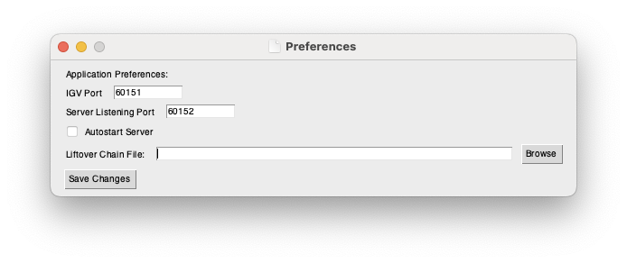
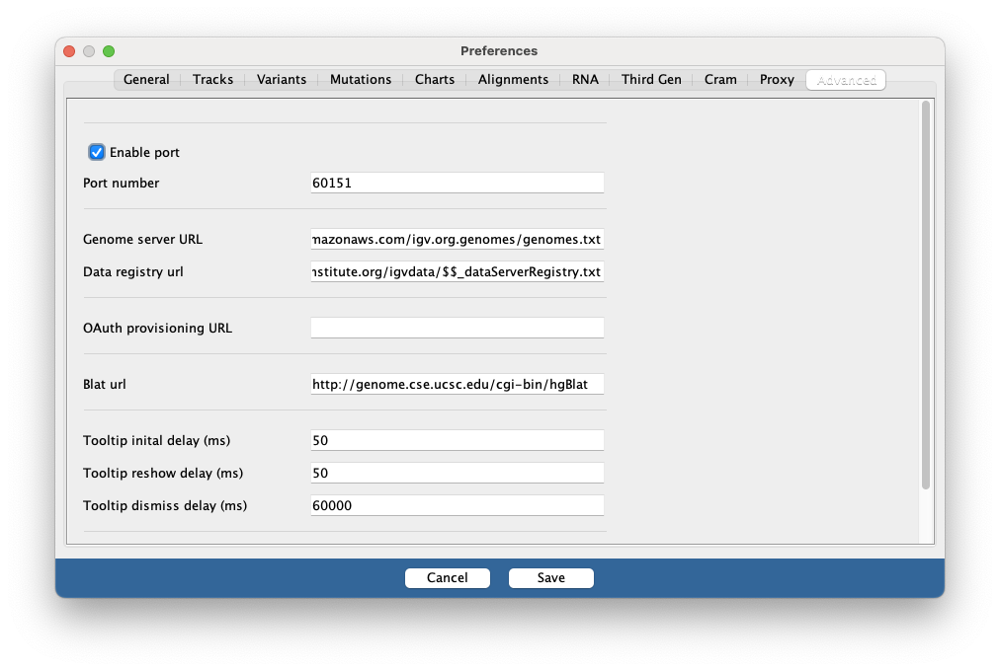
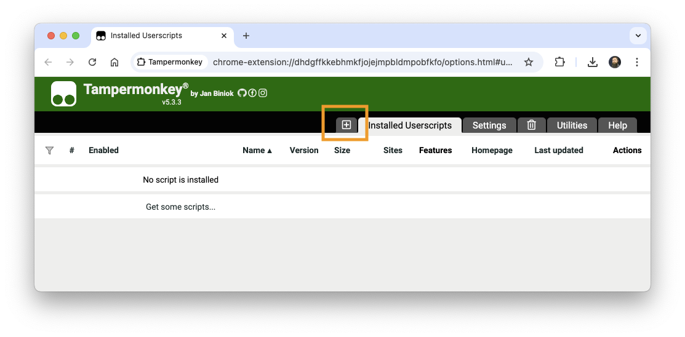
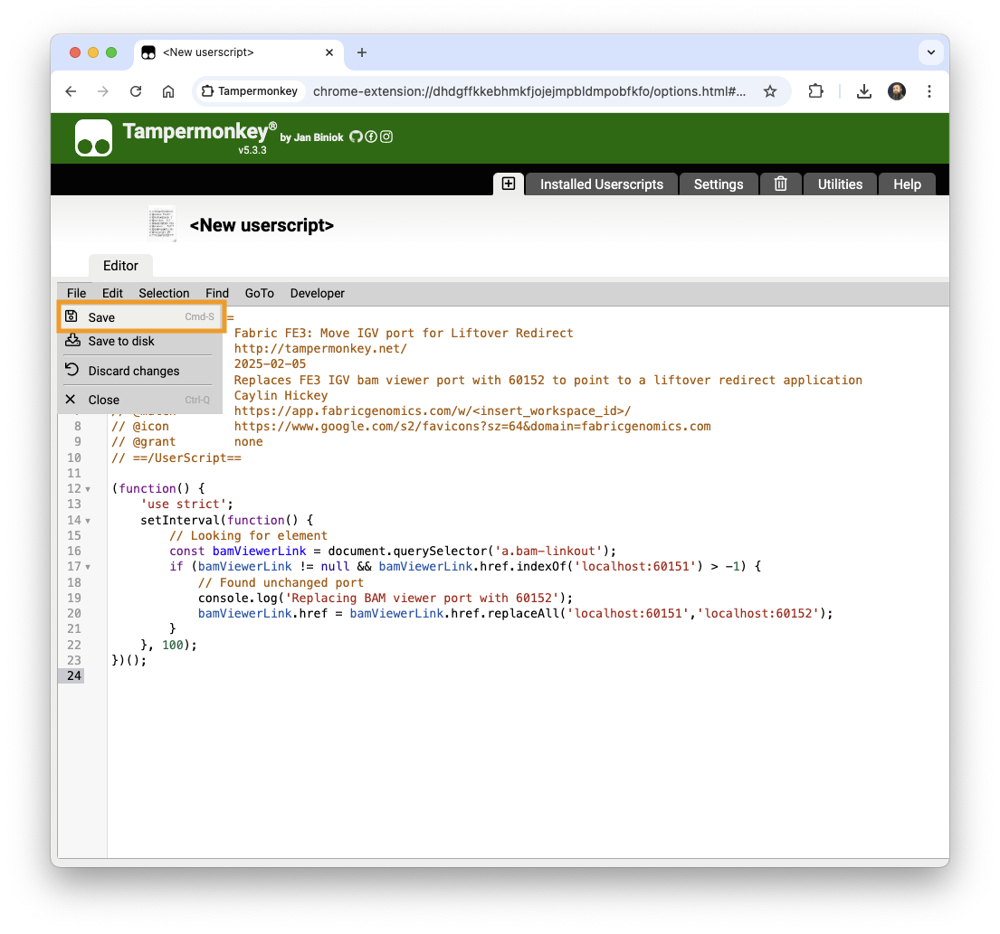
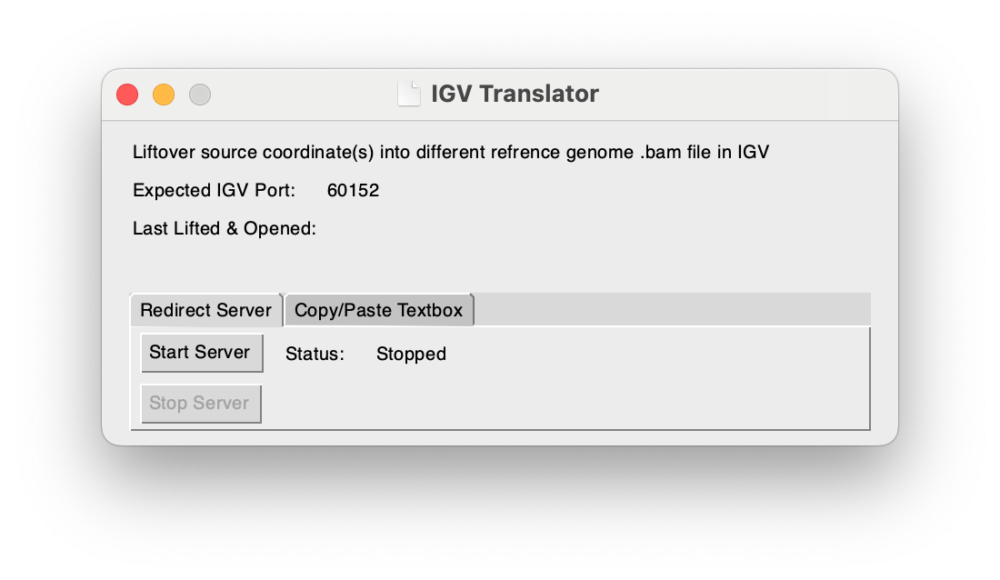
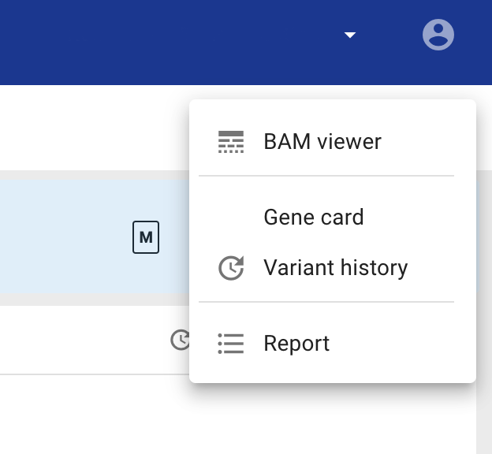
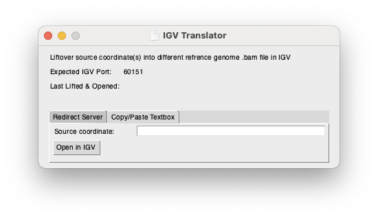
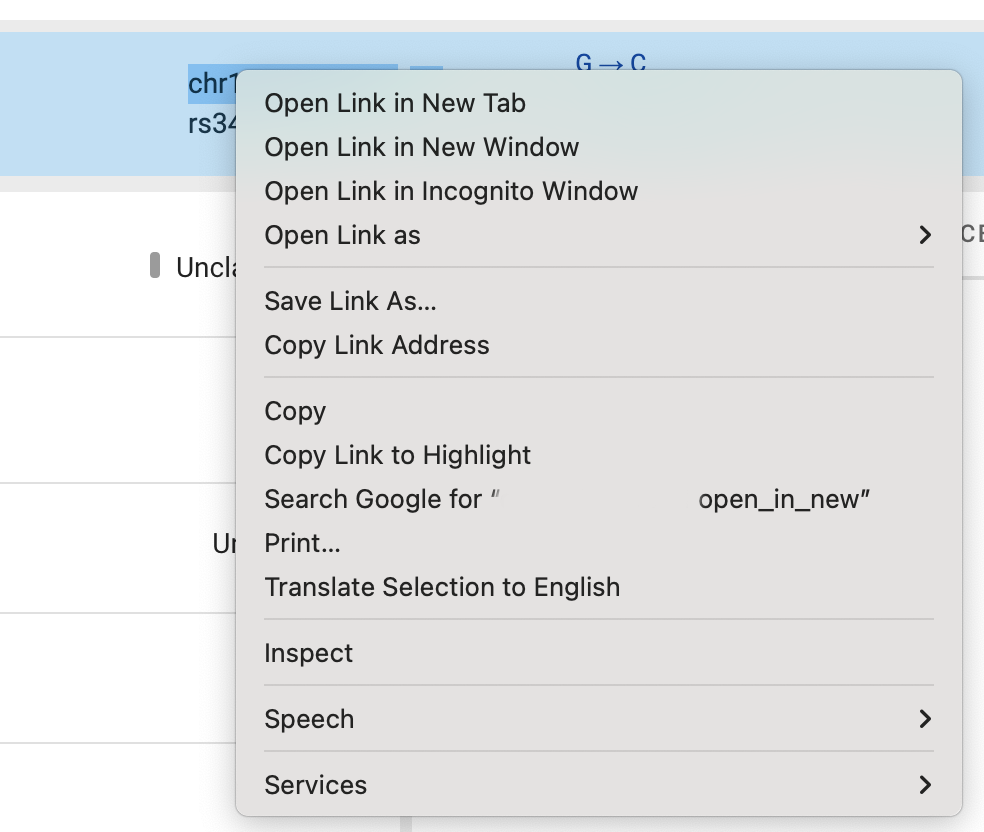

# IGV Translator

Simple Python application to translate loci from one reference genome to another using liftover to nagivate to loci in 
IGV. The purpose of this application is to proxy locations from one reference genome to another without requiring the 
user to manully lift over the coordinates and enter them into IGV. The application provides two modes of use:
1. As a man-in-the-middle proxy webserver
2. As a copy-and-paste manual redirect

In both cases, the application opens a new tab in your webbrowser in the standard IGV format: 
```http://localhost:<igv_listening_port>/goto?locus=<chrom>:<locus>(-<locus>)```

### Table of Contents:
- [Modes](#modes)
  - [Man-in-the-Middle Proxy Server Mode](#man-in-the-middle-proxy-server-mode)
  - [Manual Copy-and-Paste Mode](#manual-copy-and-paste-mode)
- [Configuration](#configuration)
  - [Setup](#setup)
    - [IGV Port](#igv-port)
    - [Autostart Server](#autostart-server)
    - [Liftover Chain File](#liftover-chain-file)
  - [Browser Userscript Installation](#browser-userscript-installation)
- [Usage](#usage)
  - [Server Mode](#server-mode)
  - [Copy-and-Paste Mode](#copy-and-paste-mode)

## Modes
### Man-in-the-Middle Proxy Server Mode

In this mode, the Python application listens on a designated port (default: `60152`) for properly formatted IGV requests. 
Once received, the locus (or loci range) are lifted over to the desired reference genome and a `303` redirect is issued 
to the current port IGV is listening on, opening to the appropriate locus or loci range.

**IMPORTANT:** While the default port of `60152` prevents this application from interferring with IGV operations, it means
existing links will still point to IGV directly and thus not be translated as desired. There are two methods to use proxy
server mode:

1. Rewrite existing links to point to 60152 (this can be done automatically for webpages 
[using an userscript](#browser-userscript-installation))
2. Swap the [IGV port](#igv-port) to `60152` and [Server Listening Port](#server-listening-port) to `60151` in the 
[Preferences Window](#preferences-window) and update the IGV application listening port to `60152` (as seen in 
[IGV port](#igv-port))

There are advantages and disadvantages to each approach. Using the userscript lets most existing links continue working
with IGV while targeted webpages can be fixed, but management becomes complicated if multiple sources of incorrect links
need to be modified. Swapping the ports is much more straightforward, but existing links to `60151` from other sources
(such as files, etc.) will then stop working meaning you'd need to either modify those files or continue modifying the
IGV port back and forth as needed.

### Manual Copy-and-Paste Mode

In this mode, the user copies the coordinates, pastes them into the text box, and clicks [`Open in IGV`] which will open 
a new tab in your webbrowser with the appropriate port and lifted over coordinate(s).

## Configuration
### Setup

#### Preferences Window
Configuration options are available in the File -> Preferences pane:


##### IGV Port
(Default: 60151)

Set this to the port your local IGV is listening on, configured in IGV -> Settings -> Advanced:


##### Server Listening Port
(Default: 60152)

Set this to the port your localhost requests will point to (e.g. `http://localhost:60152/goto?locus=...` would be `60152`). 
In order to reduce disruption of other uses of IGV, it is preferable to use a UserScript (e.g. TamperMonkey) to swap the 
ports in your specific website automatically for you in order to limit the impact of these changes.

##### Autostart Server
(Default: false)

This option controls whether the man-in-the-middle server should start when you open this application. (Default: false)

##### Liftover Chain File
(Default: blank)

This option tells the application which liftover chain file to use for translating your coordinates.

### Browser Userscript Installation

**NOTE:** This is done in your webbrowser, not in this application

By default [server mode](#server-mode) listens on port `60152`. This is to avoid conflict with IGV's default port of 
`60151`. In this configuration, existing links designed to open IGV will open IGV directly and not trigger a liftover
translation. As this system was designed to intercept links from a website, this section will detail how to use
browser userscripts to modify only specific websites (an example of which can be found at 
[userscript.js](userscript.js))

#### Step 1: Install an userscript browser extension

We'll use [Tampermonkey](https://www.tampermonkey.net/) as an example as it supports most current browsers, but this
should be achievable with any userscript extension. Open your extension store (for example: 
[Chrome Web Store](https://chromewebstore.google.com/), [Microsoft Edge Add-ons](https://microsoftedge.microsoft.com/))
and search for (and install) Tampermonkey.

#### Step 2: Open Tampermonkey and install the script

Your browser should have an extensions button next to the address bar:


Please click that button and open Tampermonkey. This will show the main window. Please click the [`+`] button to add a 
new script:



Now paste the contents of [userscript.js](userscript.js) into the script window, replacing the existing text. You will 
need to edit line 7: `// @match        https://app.fabricgenomics.com/w/<insert_workspace_id>/` and insert the correct
Fabric FE3 workspace ID (which you can find in the address bar in an active Fabric browser tab) to make the script work
correctly as well as limit it to only the workspace needing translation. Finally save and activate the script by 
clicking `File` -> `Save`:



The script editor should close and you'll see that the script is now active.

#### Step 3: Testing the script

This script is designed to edit (in the background) IGV links in Fabrics FE3 environment to point to port `60152` instead
of port `60151` for a specific workspace. To test this, simply click the [`BAM viewer`] button (as seen in 
[Server Mode](#server-mode)) and check to make sure the website it directed you to looks like
`http://localhost:60152/goto?locus=...` instead of `http://localhost:60151/goto?locus=...`

## Usage
The main window displays both the current port the program expects IGV to be listening on (can be editted in 
[IGV Port](#igv-port) setting) as well as the last lifted and opened coordinate(s) from either mode of use. Below this 
information is a tabular window with which you can choose your mode of operation by selecting the appropriate tab.

### Server Mode

By default, the server will remain stopped after you launch the application. It can be started manually by clicking the 
[`Start Server`] button, which will launch the server and display the active listening state. The server can then be 
stopped using the [`Stop Server`] button.



Once the server is running, you can proceed to access existing IGV links that would normally point to IGV (such as 
Fabric's BAM viewer button)



### Copy-and-Paste Mode
This mode searches the provided input string for the `chr#:###` locus pattern, lifted over, and sent to IGV on the 
expected port.



The input can come from any other copied text (such as right-clicking a variant's locus in Fabric's variant pane and 
clicking `Copy Link Address`):



Clicking [`Open in IGV`] will then send the lifted over coordinates to IGV to open the correct location.