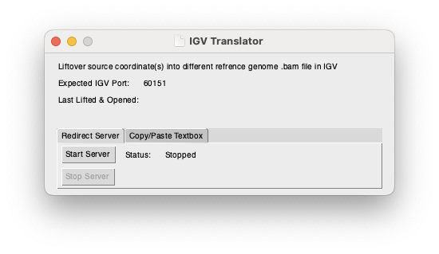

# IGV Translator

Simple Python application to translate loci from one reference genome to another using liftover to nagivate to loci in IGV. The purpose of this application is to proxy locations from one reference genome to another without requiring the user to manully lift over the coordinates and enter them into IGV. The application provides two modes of use:
1. As a man-in-the-middle proxy webserver
2. As a copy-and-paste manual redirect

In both cases, the application opens a new tab in your webbrowser in the standard IGV format: 
```http://localhost:<igv_listening_port>/goto?locus=<chrom>:<locus>(-<locus>)```

**NOTE: IGV should be running before you use either mode of operation**

### Table of Contents:
- [Modes](#modes)
  - [Man-in-the-Middle Proxy Server Mode](#man-in-the-middle-proxy-server-mode)
  - [Manual Copy-and-Paste Mode](#manual-copy-and-paste-mode)
- [Configuration and Usage](#configuration-and-usage)
  - [Setup](#setup)
    - [IGV Port](#igv-port)
    - [Autostart Server](#autostart-server)
    - [Liftover Chain File](#liftover-chain-file)
  - [Usage](#usage)
    - [Server Mode](#server-mode)
    - [Copy-and-Paste Mode](#copy-and-paste-mode)

## Modes
### Man-in-the-Middle Proxy Server Mode

In this mode, the Python application listens on a designated port (default: `60152`) for properly formatted IGV requests. Once received, the locus (or loci range) are lifted over to the desired reference genome and a `303` redirect is issued to the current port IGV is listening on, opening to the appropriate locus or loci range.

### Manual Copy-and-Paste Mode

In this mode, the user copies the coordinates, pastes them into the text box, and clicks [`Open in IGV`] which will open a new tab in your webbrowser with the appropriate port and lifted over coordinate(s).

## Configuration and Usage
### Setup
Configuration options are available in the File -> Preferences pane:


#### IGV Port
(Default: 60151)

Set this to the port your local IGV is listening on, configured in IGV -> Settings -> Advanced:


#### Server Listening Port
(Default: 60152)

Set this to the port your localhost requests will point to (e.g. `http://localhost:60152/goto?locus=...` would be `60152`). In order to reduce disruption of other uses of IGV, it is preferable to use a UserScript (e.g. TamperMonkey) to swap the ports in your specific website automatically for you in order to limit the impact of these changes.

#### Autostart Server
(Default: false)

This option controls whether the man-in-the-middle server should start when you open this application. (Default: false)

#### Liftover Chain File
(Default: blank)

This option tells the application which liftover chain file to use for translating your coordinates.

### Usage
The main window displays both the current port the program expects IGV to be listening on (can be editted in [IGV Port](#igv-port) setting) as well as the last lifted and opened coordinate(s) from either mode of use. Below this information is a tabular window with which you can choose your mode of operation by selecting the appropriate tab.

#### Server Mode
_NOTE: It is suggested that you use port `60152` in IGV when using Server Mode as existing requests need to be captured on the default 60151 port._

By default, the server will remain stopped after you launch the application. It can be started manually by clicking the [`Start Server`] button, which will launch the server and display the active listening state. The server can then be stopped using the [`Stop Server`] button.


Once the server is running, you can proceed to access existing IGV links that would normally point to IGV (such as Fabric's BAM viewer button)


#### Copy-and-Paste Mode
This mode searches the provided input string for the `chr#:###` locus pattern, lifted over, and sent to IGV on the expected port.


The input can come from any other copied text (such as right-clicking a variant's locus in Fabric's variant pane and clicking 'Copy Link Address'):


Clicking [`Open in IGV`] will then send the lifted over coordinates to IGV to open the correct location.